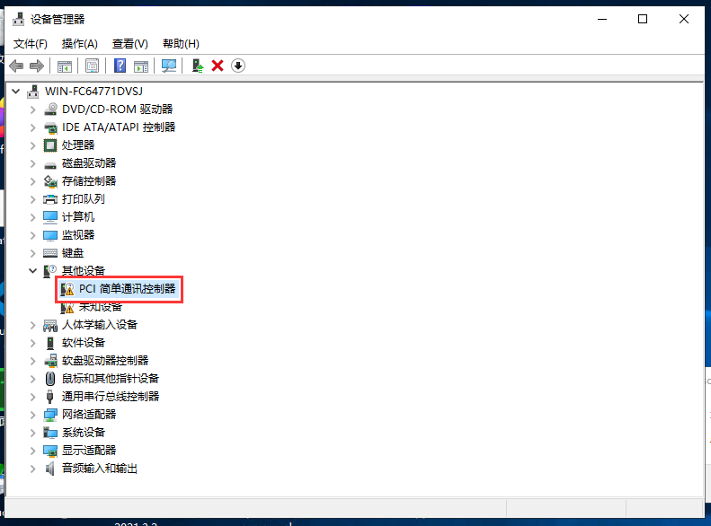
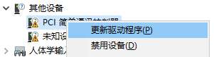
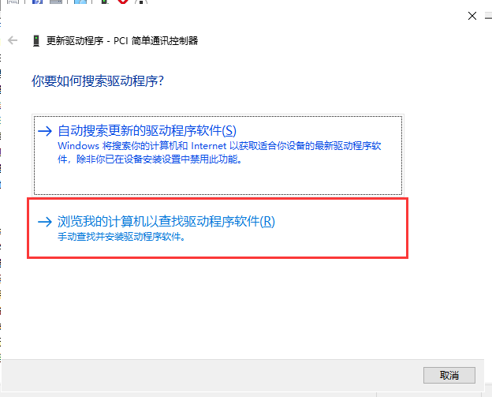
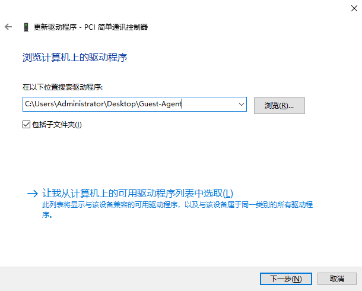
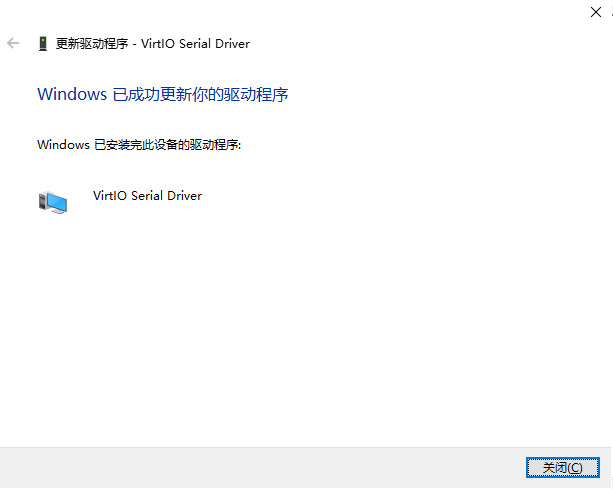
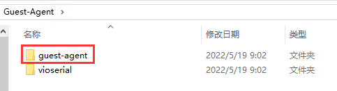
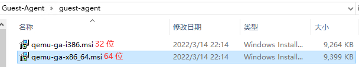

# 安装 Qemu-Guest-Agent

## Windows

下载 Windows 版本 Guest-Agent 并解压至文件夹内  
- [Github Pages](Guest-Agent.zip)
- [蓝奏云](https://ncgs.lanzoul.com/iJMIt053s90b)  
- [OneDrive](https://ncgst-my.sharepoint.com/:u:/g/personal/modcraft_ncgst_onmicrosoft_com/EdcgFNOGM2ZIinVq7WQZfcEBHergZnIau6Ba9Wf3DE3OMw)  

### 安装 `virtio-serial` 驱动程序  

1. 打开 `设备管理器` 在 `其他设备` 中找到 `PCI 简单通讯控制器`  
   
   > 如果无法找到 `PCI 简单通讯控制器`, 请联系管理员为您开启
2. 右键选择 `更新驱动程序`  
   

3. 选择 `浏览我的计算机以查找驱动程序软件`  
   

4. 填入 **解压** 后文件夹目录  
   > 注意勾选 `包括子文件夹`  
   
       
   
   > 出现如下提示即安装成功  
   >   

### 安装 `qemu-guest-agent`  

1. 进入解压后的文件目录  

2. 打开 `guest-agent`文件夹  
     

3. 并执行相应版本的安装程序  
     
   > 64 位系统安装 `qemu-ga-x86_64.msi`  
   > 32 位系统安装 `qemu-ga-i386.msi`  

至此, qemu-guest-agent 应该已经启动并运行。   
您可以在 **Window 服务列表** 中或在 **PowerShell** 中使用以下命令对此进行验证  

```
PS C:\Users\Administrator> Get-Service QEMU-GA

Status   Name               DisplayName
------   ----               -----------
Running  QEMU-GA            QEMU Guest Agent
```

如果它没有运行，您可以使用 **服务** 控制面板启动它，并确保它会在下次服务器启动时自动启动  

## Linux
在 Linux 上，您只需安装 `qemu-guest-agent`，请参阅您系统的文档。  

我们在这里展示基于 Debian/Ubuntu 和 Redhat 的系统的命令：  

在基于 Debian/Ubuntu 的系统 (apt-get) 上运行：  
`apt-get install qemu-guest-agent`  
在基于 Redhat 的系统上 (yum)：  
`yum install qemu-guest-agent`

在某些发行版 Linux 中 qemu-guest-agent 可能不会自动启动, 
请使用 `systemctl start qemu-guest-agent` 启动它


***

教程内容来自 [官方文档](https://pve.proxmox.com/wiki/Qemu-guest-agent)